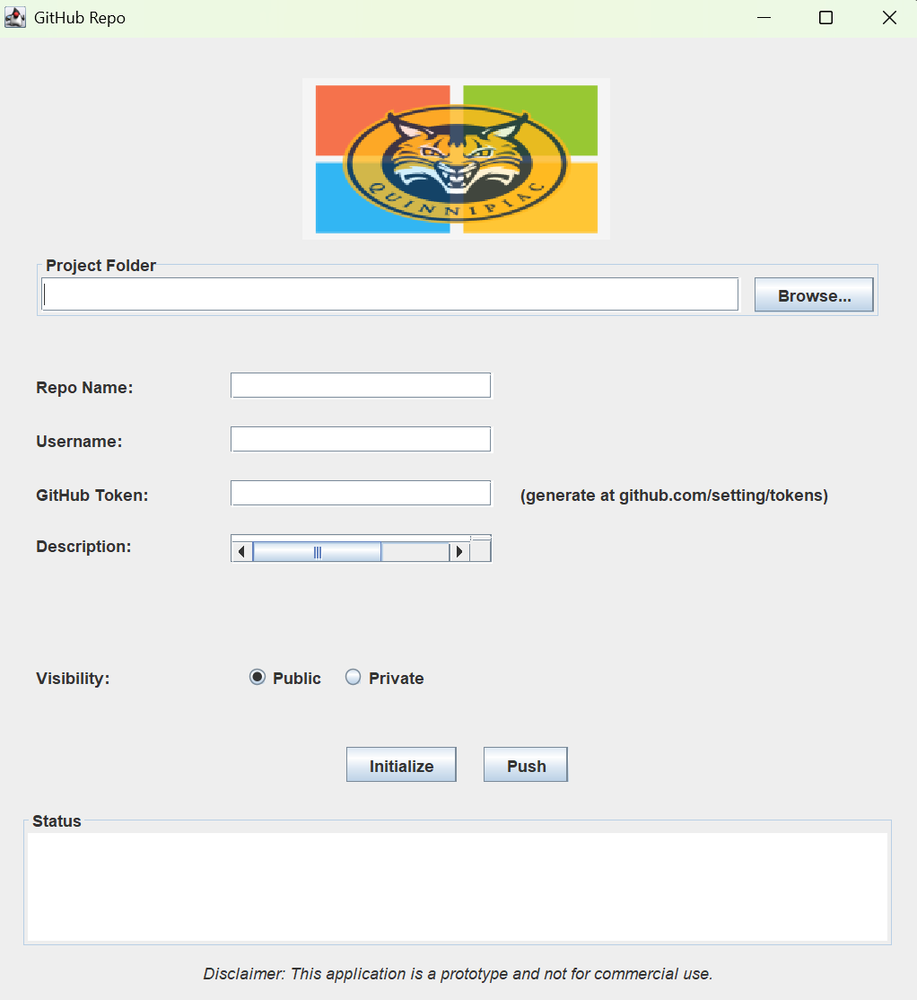

# GitHub GUI

This GUI is a swing-based application that allows users to easily create, initialize, and push local git repositories to GitHub. It allows developers to manage Git and GitHub features without useing the command line. 

## Features

* Create a GitHub repository
* Initialize a local Git Repository and add both a .gitignore and a README.md
* Push a local repository to a newly created GitHub repository
* Enter repository details

## How it Works

1. Select your local project folder
2. Enter repository name, access token, and a description
3. Choose **public** or **private**
4. Click **Initialize** to:
    * Create a local repository
    * Commit initial changes
    * Create a GitHub repository
    * Add the GitHub repository as a remote orgin
5. Click **Push** to push your local project to GitHub

## Example Screenshot

## Disclaimer

This application is a **prototype** and is **not intended for commercial use**